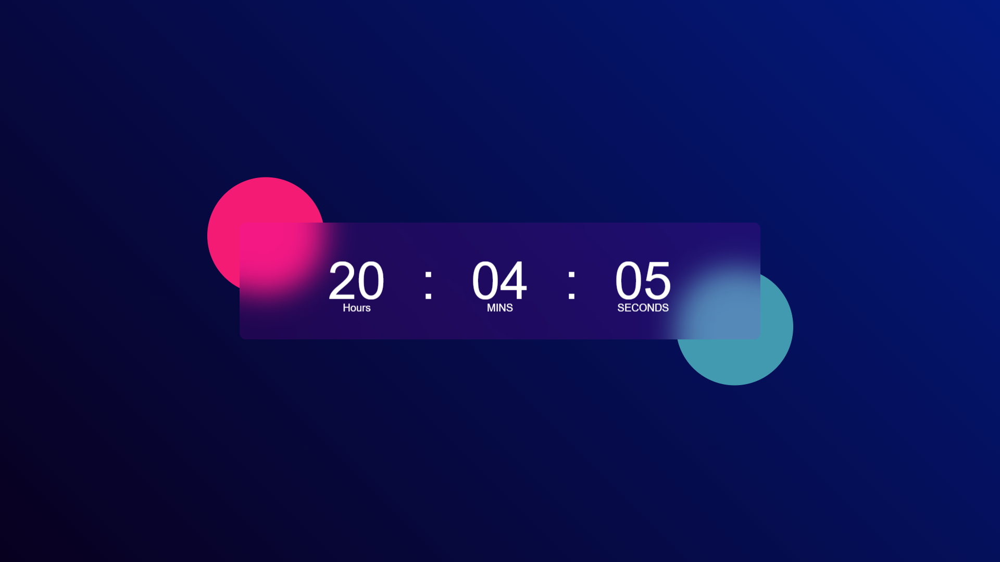
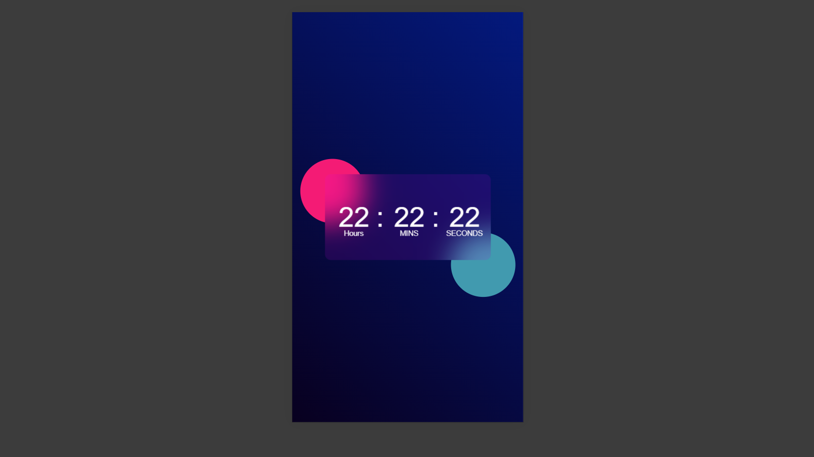

# JavaScript Clock



This project is a simple digital clock implemented using HTML, CSS, and JavaScript. It displays the current time in hours, minutes, and seconds and updates every second.

## Features

- **Live Clock:** Displays the current time and updates every second.
- **Responsive Design:** Adjusts to different screen sizes.
- **Modern Design:** Features a visually appealing clock face with gradients and shadows.

## Screenshots

### Desktop


### Mobile



## Files

- **index.html:** Contains the basic structure of the clock and links to the CSS and JavaScript files.
- **styles.css:** Styles the clock, including layout, colors, and responsive design.
- **script.js:** Contains the JavaScript code that updates the clock every second.

## How to Use

1. **Open the `index.html` File:**
   - You can open the `index.html` file in any modern web browser to view the clock. Simply double-click the file or open it using your browser's "Open File" option.

2. **View the Clock:**
   - The clock will display the current time in hours, minutes, and seconds. It will automatically update every second.

## Installation

To set up and run the JavaScript Clock on your local machine:

1. **Clone the Repository:**
   ```bash
   git clone https://github.com/Iqbolshoh/javascript-clock.git
   ```
2. **Navigate to the Project Directory:**
   ```bash
   cd javascript-clock
   ```
3. **Open the `index.html` File:**
   Open the `index.html` file in any modern web browser to start using the clock.

## Project Structure

- **index.html:** Contains the HTML structure and includes links to the CSS and JavaScript files.
- **styles.css:** Styles the clock and provides a responsive layout.
- **script.js:** Handles the clock logic, updating the time every second.

## Technologies

<div style="display: flex; flex-wrap: wrap; gap: 5px;">
    
    
    
</div>


## Connect with Me

I love connecting with new people and exploring new opportunities. Feel free to reach out to me through any of the platforms below:

<table>
    <tr>
        <td>
            <a href="https://t.me/iqbolshoh_777">
                
            </a>
        </td>
        <td>
            <a href="https://instagram.com/iqbolshoh_777" target="blank"></a>
        </td>
        <td>
            <a href="https://wa.me/qr/22PVFQSMQQX4F1">
                
            </a>
        </td>
        <td>
            <a href="https://x.com/iqbolshoh_777">
                
            </a>
        </td>
        <td>
            <a href="https://www.linkedin.com/in/iqbolshoh/">
                
            </a>
        </td>
        <td>
            <a href="mailto:iilhomjonov777@gmail.com">
                
            </a>
        </td>
    </tr>
</table>
